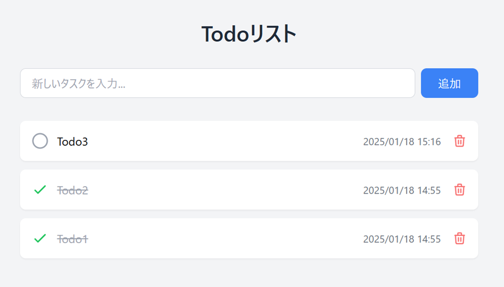
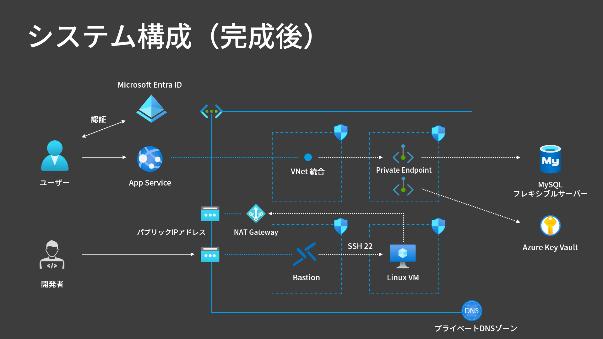

## 作りながら覚える Microsoft Azure 実践講座 (App Service + MySQL)

Azure の [動画講座](https://www.udemy.com/course/azure-appservice-mysql-app-flask/) で取り上げる Todo アプリのソースコードです。</br>
Flask と Tailwind CSS を使用して構築されたモダンなデザインのシンプルなタスク管理ツールです。


## インフラ構成図



## 使用技術

- バックエンド

  - Python 3.12.4
  - Flask 3.1.0
  - Flask-SQLAlchemy 3.1.1
  - MySQL 8.0
  - SQLite

- フロントエンド

  - HTML5
  - Tailwind CSS

- インフラ
  - Terraform
  - Azure Developer CLI (azd)
  - App Service
  - MySQL Flexible Server
  - Key Vault
  - Bastion
  - Virtual Machines
  - NAT Gateway
  - Private Endpoint

## デプロイ

```bash
# リポジトリのクローン
git clone https://github.com/m-oka-system/python-flask-mysql-todo.git
cd python-flask-mysql-todo/

# Azure インフラのプロビジョニングと Todo アプリのデプロイ
azd up
```

## クリーンアップ

```bash
# Azure Developer CLI で全リソースを削除
azd down

# もしくは
# Azure CLI でリソースグループを削除
az group delete --name <resource-group-name> --yes
```

## プロジェクト構造

```
python-flask-mysql-todo/
│
├── azure.yaml                       # Azure Developer CLI (azd) の設定ファイル
├── src/
│   ├── app.py                       # Flaskアプリケーションのメインファイル
│   ├── requirements.txt             # 依存パッケージリスト
│   ├── .webappignore                # Zip デプロイ時の除外設定
│   ├── DigiCertGlobalRootCA.crt.pem # SSL ルート証明書
│   ├── instance/
│   │   └── todo.db                  # SQLite データベース（開発環境用）
│   └── templates/
│       └── index.html               # テンプレートファイル
│
└── infra/                           # Terraform のソースコード
    ├── main.tf                      # メイン定義ファイル
    ├── provider.tf                  # プロバイダー
    ├── variables.tf                 # インプット変数
    ├── outputs.tf                   # 出力
    └── main.tfvars.json             # 環境変数
```
